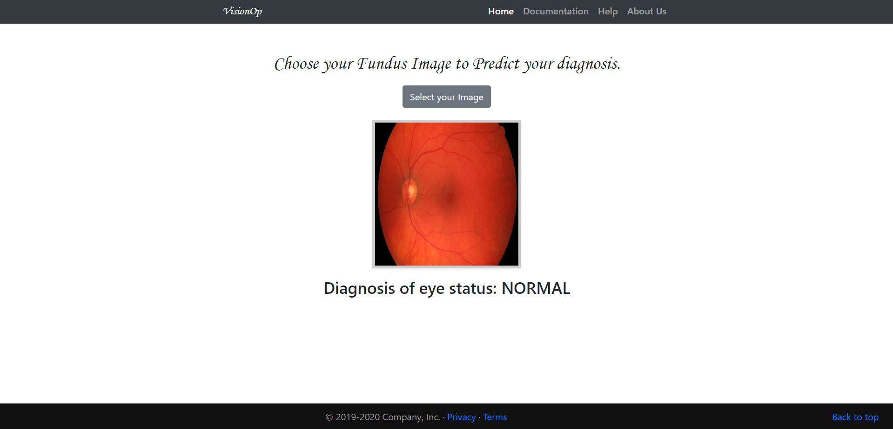
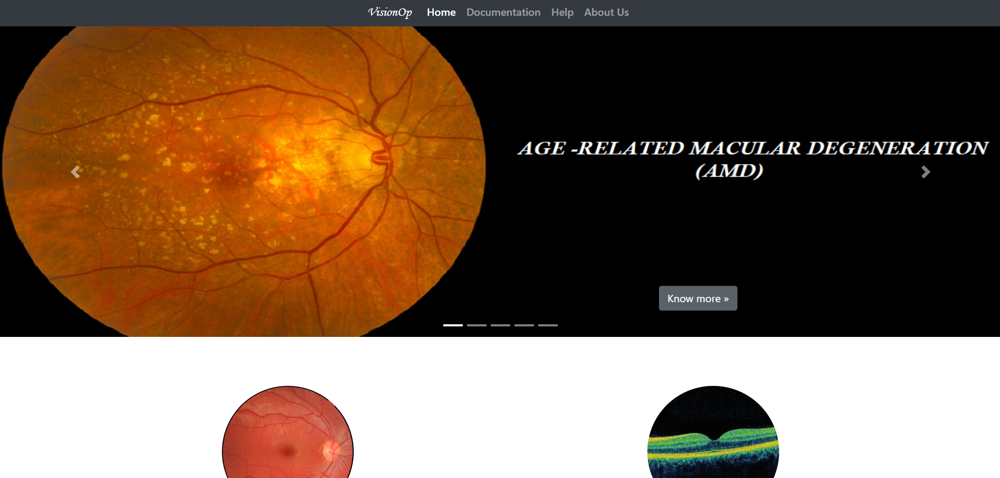
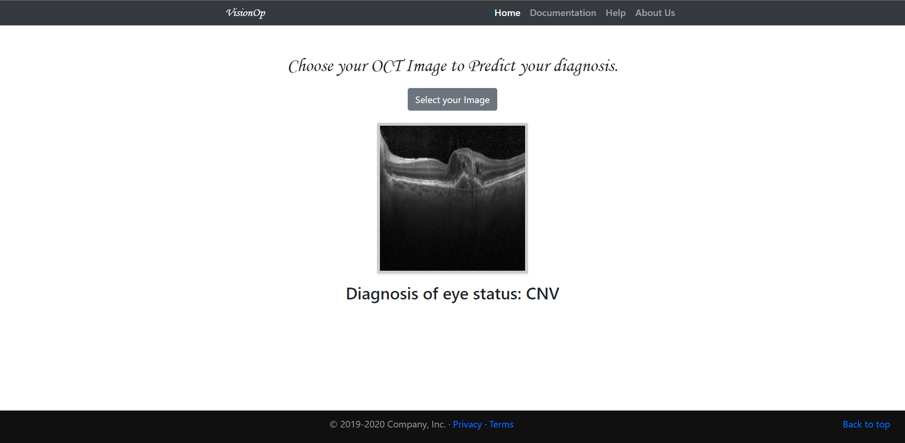
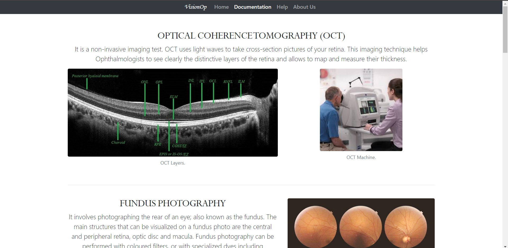
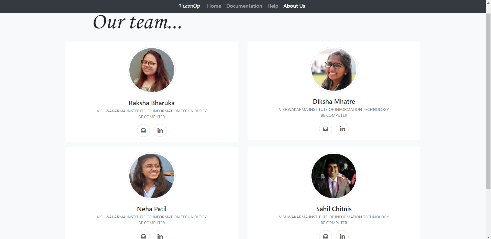

# Glaucoma-Prediction
Prediction and classification of eye diseases using flask.
Pre-requisite:-
1) Pycharm Or any IDE.
2) Tensorflow.
3) Python 3.6.
4) Flask.
5) Chrome or Firefox.

How to run:- 
Run the test.py file from the folder.

What it does:-
* Predicts and Classifies diseases using OCT and Fundus images.
* Glaucoma, AMD, Drusen, CNV are the diseases which can be predicted.
* Contains all the documentation needed and how to navigate through website.

ScreenShots:-

